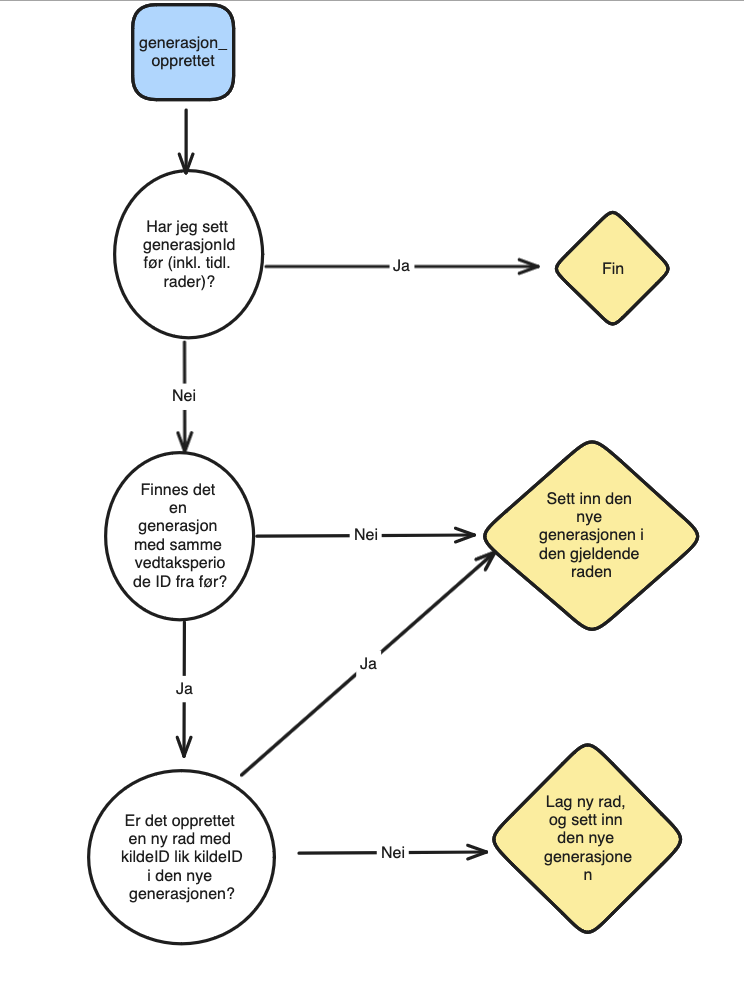

pølsefabrikk
============

Bygger opp en representasjon pølser i Speil, dvs. 
rekkefølgen på pølsene og radene.

Spleis oppretter nye generasjoner på en Vedtaksperiode når det skal startes en ny behandling.
Det vil si at når en generasjon opprettes så har det skjedd noe nytt i saken, og det skal fattes nytt vedtak.

Derfor vil Spekemat i all hovedsak lage ny rad hver gang den mottar en ny generasjon dersom
Vedtaksperioden er kjent fra før.

#### Hvordan gjenkjennes en revurdering?

Spekemat mottar en ny generasjon når Spekemat har kjennskap til Vedtaksperioden fra før (dvs. har mottatt en generasjon tidligere).

#### Hvordan gjenkjennes en annullering?

På samme måte som en revurdering, bare at den nye generasjonen forkastes. Dvs. en annullering
gjenkjennes ved at det er en generasjon `status=FORKASTET`, og andre generasjoner i eldre rader som er `status=LUKKET` 

#### Hvordan gjenkjennes ting som forkastes før vedtak er fattet?

Det er en generasjon med `status=FORKASTET` uten at det finnes en annen generasjon for samme Vedtaksperiode i en eldre rad

#### Hvordan sikrer Spekemat at en revurdering som revurderer `n` andre vedtaksperioder ikke lager `n` rader?

Når Spekemat lager en ny rad så beholder Spekemat en referanse til `kildeID` som medførte ny rad; i praksis den første
nye revurdering-generasjonen. På alle påfølgende nye generasjoner så vil `kildeID` peke til den samme som raden ble opprettet med,
og da vet Spekemat at den allerede har laget ny rad.

# Henvendelser
Spørsmål knyttet til koden eller prosjektet kan stilles som issues her på GitHub.

## For NAV-ansatte
Interne henvendelser kan sendes via Slack i kanalen #team-bømlo-værsågod.
